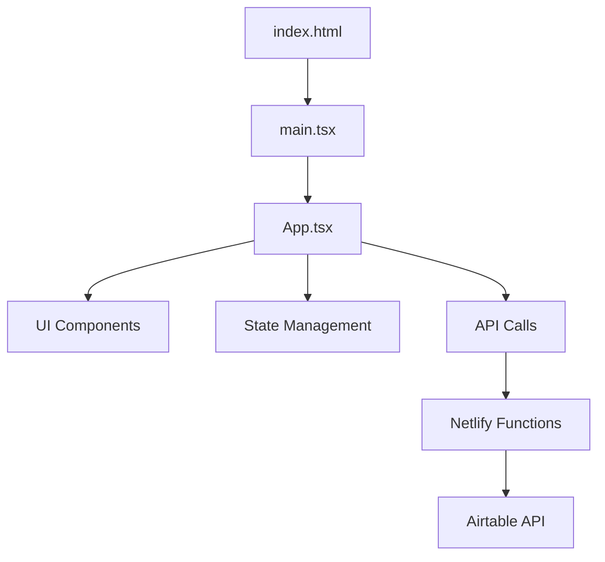

# 🏗️ PROJECT ARCHITECTURE - AdminSupabase1.0

## 📌 Обзор проекта

### Назначение
Учебная админ-панель для управления переменными в облачной базе данных с возможностью интеграции с разными backend-сервисами (Airtable/Supabase).

### Текущая версия
- **Ветка:** main (интеграция с Airtable)
- **Альтернатива:** ветка 3.0sb (интеграция с Supabase)
- **Статус:** ✅ Рабочий прототип
- **URL деплоя:** https://11-adminpanel-001.netlify.app/

### Основные возможности
- ✅ Просмотр текущих значений переменных
- ✅ Создание новых записей с переменными
- ✅ Автообновление данных после изменений
- ✅ Mock-режим для локальной разработки
- ✅ Обработка ошибок и состояний загрузки

---

## 🛠️ Технологический стек

### Frontend
| Технология | Версия | Назначение |
|------------|--------|------------|
| React | 18.3.1 | UI фреймворк |
| TypeScript | 5.5.3 | Типизация |
| Vite | 5.4.2 | Сборщик и dev-сервер |
| Tailwind CSS | 3.4.1 | Стилизация |
| Lucide React | 0.344.0 | Иконки |

### Backend
| Технология | Назначение |
|------------|------------|
| Netlify Functions | Serverless API endpoints |
| Airtable API | База данных (main ветка) |
| JavaScript (ES6+) | Язык для serverless функций |

### DevOps
| Инструмент | Назначение |
|------------|------------|
| Netlify | Хостинг, CI/CD, serverless |
| Git | Версионирование |
| npm | Управление пакетами |

---

## 📁 Структура проекта

```
AdminSupabase1.0-main/
├── 📂 src/                        # Исходный код приложения
│   ├── 📄 App.tsx                 # Главный компонент (262 строки)
│   ├── 📄 main.tsx                # Точка входа React
│   ├── 📄 index.css               # Глобальные стили + Tailwind
│   └── 📄 vite-env.d.ts          # TypeScript типы для Vite
│
├── 📂 netlify/                    # Serverless функции
│   └── 📂 functions/
│       └── 📄 airtable-api.js     # API endpoint (171 строка)
│
├── 📂 node_modules/               # Зависимости (200 пакетов)
├── 📂 .git/                       # Git репозиторий
├── 📂 .bolt/                      # Конфигурация Bolt
│
├── 📄 package.json                # Зависимости и скрипты
├── 📄 package-lock.json           # Заблокированные версии
├── 📄 vite.config.ts              # Конфигурация Vite
├── 📄 tsconfig.json               # Главная конфигурация TS
├── 📄 tsconfig.app.json           # TS конфигурация для приложения
├── 📄 tsconfig.node.json          # TS конфигурация для Node
├── 📄 tailwind.config.js          # Конфигурация Tailwind
├── 📄 postcss.config.js           # PostCSS для Tailwind
├── 📄 eslint.config.js            # Конфигурация линтера
├── 📄 netlify.toml                # Настройки деплоя
├── 📄 index.html                  # HTML шаблон
├── 📄 README.md                   # Документация (216 строк)
├── 📄 push_git.sh                 # Скрипт для git push
└── 📄 .gitignore                  # Игнорируемые файлы
```

---

## 🔄 Архитектура приложения

### Компонентная структура



### Поток данных

1. **Инициализация**
   - App.tsx монтируется → вызывает `fetchVariables()`
   - Проверяется режим (DEV/PROD)
   - DEV: возвращаются mock-данные
   - PROD: запрос к Netlify Function

2. **Получение данных (GET)**
   ```
   Frontend → /.netlify/functions/airtable-api
   → Airtable API → Возврат последней записи
   ```

3. **Создание записи (POST)**
   ```
   Frontend → /.netlify/functions/airtable-api
   → Airtable API → Создание новой записи
   → Обновление UI
   ```

### Состояния компонента App.tsx

| State | Тип | Назначение |
|-------|-----|------------|
| currentValues | Variables | Текущие значения из БД |
| formValues | Variables | Значения в форме |
| isLoading | boolean | Индикатор загрузки |
| isUpdating | boolean | Индикатор обновления |
| error | string \| null | Сообщение об ошибке |
| success | boolean | Флаг успешной операции |

---

## 🔐 Конфигурация и переменные окружения

### Необходимые переменные (Netlify)
```bash
AIRTABLE_BASE_ID=appXXXXXXXXXXXXXX  # ID базы Airtable
AIRTABLE_TABLE_ID=Variables         # Название таблицы
AIRTABLE_API_KEY=patXXXXXXXXXXXXXX  # Personal Access Token
```

### Структура таблицы Airtable
| Поле | Тип | Описание |
|------|-----|----------|
| variable_1 | Single line text | Первая переменная |
| variable_2 | Single line text | Вторая переменная |
| Created | Created time | Автоматическая метка времени |

---

## 🚀 Скрипты и команды

### NPM Scripts
```json
{
  "dev": "vite",              # Запуск dev-сервера (порт 5173)
  "build": "vite build",       # Сборка для продакшена
  "lint": "eslint .",          # Проверка кода
  "preview": "vite preview"    # Предпросмотр сборки
}
```

### Git автоматизация (push_git.sh)
```bash
#!/bin/bash
git add .
git commit -m "Автоматический коммит"
git push origin main
```

---

## 🔌 API Endpoints

### GET /.netlify/functions/airtable-api
**Назначение:** Получение последней записи из таблицы

**Ответ:**
```json
{
  "records": [{
    "fields": {
      "variable_1": "значение 1",
      "variable_2": "значение 2"
    }
  }]
}
```

### POST /.netlify/functions/airtable-api
**Назначение:** Создание новой записи

**Тело запроса:**
```json
{
  "variable_1": "новое значение 1",
  "variable_2": "новое значение 2"
}
```

---

## 🎨 UI/UX структура

### Макет страницы
```
┌─────────────────────────────────┐
│       🗄️ Admin Panel            │
│   Manage Airtable Variables     │
├─────────────────────────────────┤
│   Current Values                │
│   ┌───────────────────────┐     │
│   │ Variable 1: [value]   │     │
│   │ Variable 2: [value]   │     │
│   └───────────────────────┘     │
├─────────────────────────────────┤
│   Update Variables              │
│   ┌───────────────────────┐     │
│   │ Variable 1: [______]  │     │
│   │ Variable 2: [______]  │     │
│   │   [Изменить]          │     │
│   └───────────────────────┘     │
└─────────────────────────────────┘
```

### Цветовая схема (Tailwind)
- Primary: blue-600
- Success: green (50-700)
- Error: red (100-700)
- Background: gray-50
- Cards: white

---

## 📊 Статус реализации функций

### ✅ Реализовано
- [x] Базовая структура проекта
- [x] Интеграция с Airtable API
- [x] CRUD операции (Create, Read)
- [x] Serverless функции
- [x] Обработка ошибок
- [x] Mock-режим для разработки
- [x] Адаптивный дизайн
- [x] Деплой на Netlify
- [x] Переменные окружения
- [x] CORS настройка
- [x] Логирование в serverless

### ⏳ Не реализовано
- [ ] Update существующих записей
- [ ] Delete записей
- [ ] Пагинация
- [ ] Поиск и фильтрация
- [ ] Авторизация пользователей
- [ ] Кеширование запросов
- [ ] Unit тесты
- [ ] E2E тесты
- [ ] Валидация данных на backend
- [ ] Rate limiting
- [ ] Мониторинг ошибок
- [ ] Логирование на frontend
- [ ] PWA функционал
- [ ] Offline режим
- [ ] Интернационализация (i18n)

---

## 🐛 Известные проблемы и ограничения

### Текущие ограничения
1. **Только создание записей** - нельзя редактировать существующие
2. **Нет пагинации** - показывается только последняя запись
3. **Отсутствие валидации** - минимальная проверка входных данных
4. **Нет аутентификации** - открытый доступ к панели
5. **Mock-данные в dev** - нельзя тестировать реальное API локально

### Потенциальные улучшения
1. Добавить WebSocket для real-time обновлений
2. Реализовать оптимистичные обновления UI
3. Добавить дебаунс для форм
4. Внедрить React Query для кеширования
5. Использовать React Hook Form для форм
6. Добавить темную тему
7. Реализовать экспорт данных

---

## 🔄 История изменений

### Последние коммиты
```
d8f6a45 - Автоматический коммит
2ecf626 - Update README.md
a2bf81e - Update README.md
0bd84fd - Update README.md
58ad264 - Update README.md
```

### Версии веток
- **main** - Airtable интеграция (текущая)
- **3.0sb** - Supabase интеграция (альтернативная)

---

## 📝 Заметки для разработчиков

### При добавлении новых функций
1. Обновить этот файл архитектуры
2. Добавить типы в TypeScript
3. Следовать существующим паттернам кода
4. Тестировать в mock-режиме сначала
5. Проверять CORS для новых endpoints
6. Обновлять README при изменении API

### Критические файлы
- `App.tsx` - вся бизнес-логика frontend
- `airtable-api.js` - вся логика backend
- `netlify.toml` - конфигурация деплоя
- Этот файл - источник истины о проекте

### Команда для быстрого деплоя
```bash
./push_git.sh  # Автокоммит и push
# Netlify автоматически задеплоит изменения
```

---

## 🔗 Полезные ссылки

- [Живая версия](https://11-adminpanel-001.netlify.app/)
- [Airtable API Docs](https://airtable.com/developers/web/api/introduction)
- [Netlify Functions Docs](https://docs.netlify.com/functions/overview/)
- [React Documentation](https://react.dev/)
- [Tailwind CSS](https://tailwindcss.com/)
- [Vite Guide](https://vitejs.dev/guide/)

---

*Последнее обновление: 01.09.2025*
*Автор архитектуры: AI Assistant*